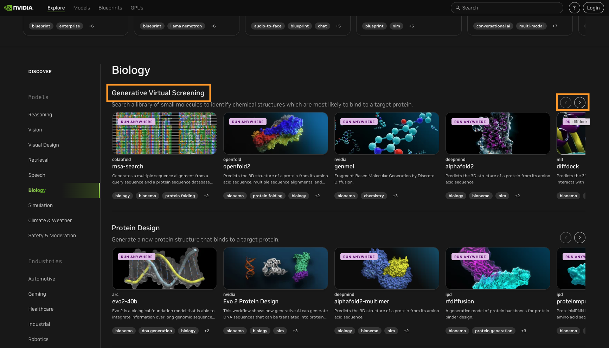
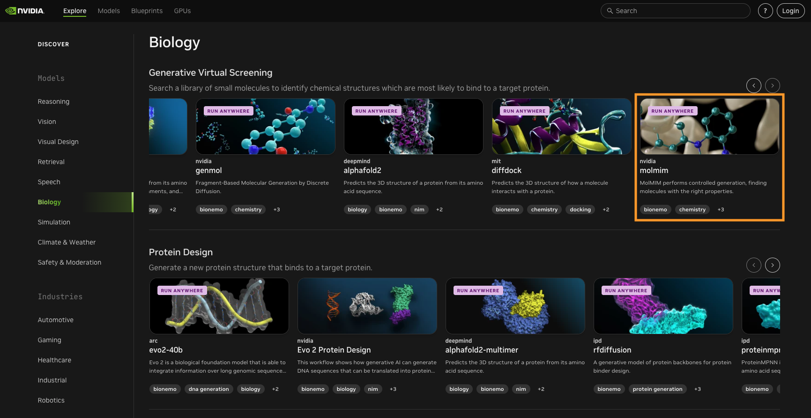
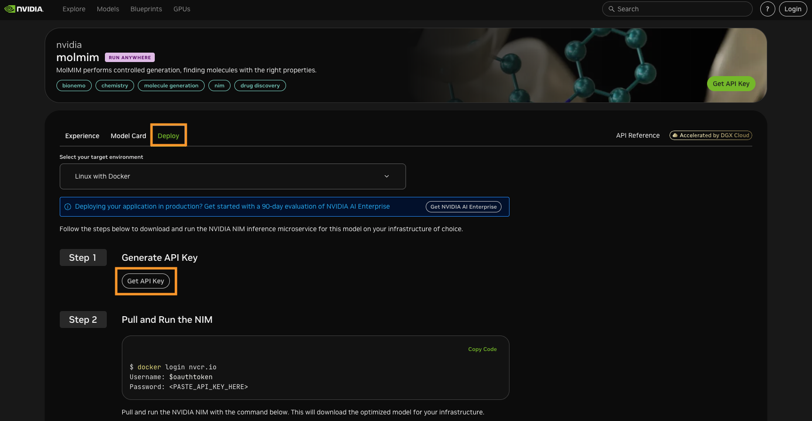
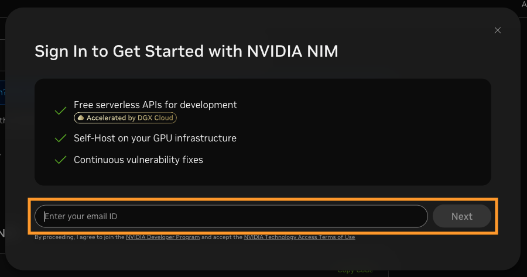
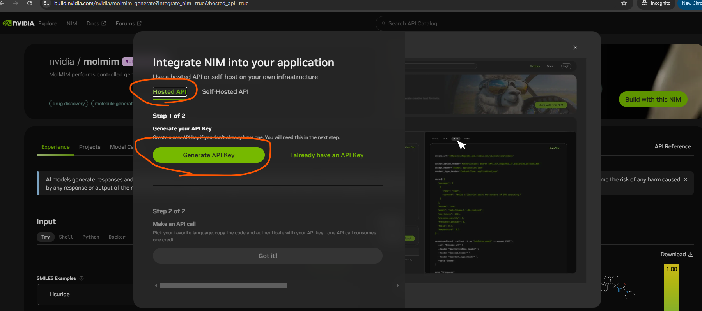
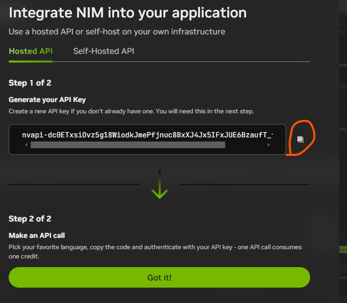
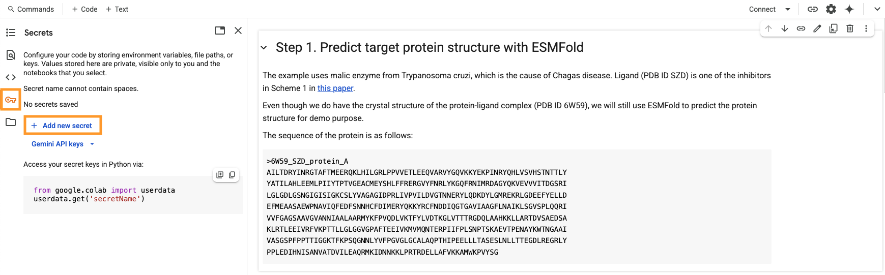
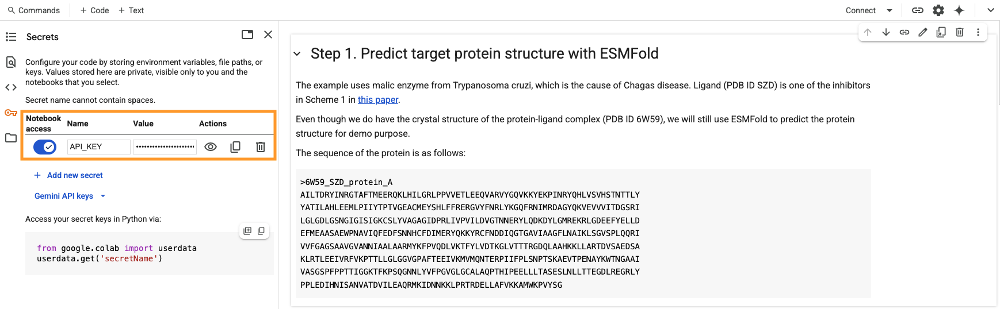

# Tutorial: Using NVIDIA BioNeMo NIMs for Virtual Screening

This tutorial demonstrates how to use **NVIDIA BioNeMo NIMs** (NVIDIA Inference Microservices) hosted on NVIDIA computing infrastructure for virtual screening tasks.

This virtual screening workflow for drug discovery combines three key steps: protein folding using ESMFold, controlled generation of small molecules with molmim, and docking those molecules into a target protein using DiffDock.

## Getting Started

1) **Generate an `API_KEY`**  
   Visit [https://build.nvidia.com](https://build.nvidia.com) to create your `API_KEY`.

2) **Set Up in Google Colab**  
   Copy and paste your `API_KEY` into the Google Colab environment as instructed.

3) **Run the Tutorial Notebooks**  
   Sequentially execute the three provided Jupyter Notebooks in the Google Colab environment, following the step-by-step instructions included in each IPYNB.

## Details

### Step 1: Generate an `API_KEY`
1) Visit [https://build.nvidia.com](https://build.nvidia.com) to create your `API_KEY`. 
2) Scroll down and click "**Biology**" in the left-hand menu (highlighted in orange below):  
 
3) Under the "**Generative Virtual Screening**" heading, click on the right arrow (highlighted in orange below) to find the "**molmim**" application:  
    
    
4) Click the "**Deploy**" tab of the heading near the left-center of the page, then click on the "**Get API Key**" button (highlighted in orange below):   
     
5) In the pop-up window that appears, enter your email address to receive free credits for using NVIDIA NIMs. Then, click "**Next**" (highlighted in orange below).  
     
6) Follow the instructions to either: 1) log in; or 2) create a free NVIDIA Developer account.  
     
7) When your `API_KEY` appears, click the button next to it to copy the key (highlighted in orange stroke below):   
     

### Step 2: Set Up in Google Colab
   You must add the `API_KEY` to your Google Colab account  
1) Click this link to open the IPYNB in Colab:   
2) Click the "**key**" button in the left-hand menu of the Colab, then click on "**+ Add new secret**" (highlighted in orange below):    
     
3) Toggle "on" the "**Notebook access**" option, then in the "**Name**" field enter `API_KEY`, and then paste the copied `API_KEY` into the "**Value**" field (highlighted in orange below):  
    

   **Note: The API Key might expire after 24 hours. If it no longer works, please repeat the above steps to generate a new API Key.**

### Step 3: Run the Tutorial Notebooks
   Run the notebooks sequentially (Steps 1, 2, 3), as the output of one is used in the next step.  
1. Predict the 3D structure of the folded protein from an amino-acid sequence:  
   a) Step_1_ESMFold_Predict_Target_Protein_Structure_4WQP.ipynb   
    b) Step_1_OpenFold2_Predict_Target_Protein_Structure_4WQP.ipynb 
2. Generate small molecule ligands from a `SEED` ligand:  
    a) Step_2_GenMol_Controlled_SM_Generation_cLogP_4WQP.ipynb   
    b) Step_2_GenMol_Controlled_SM_Generation_QED_4WQP.ipynb   
    c) Step_2_MolMIM_Controlled_SM_Generation_cLogP_4WQP.ipynb   
    d) Step_2_MolMIM_Controlled_SM_Generation_QED_4WQP.ipynb   
3. Dock the ligands into the protein:  
    a) Step_3_DiffDock_Predict_SM_Docking_Poses_PDBprotein_4WQP.ipynb   
    b) Step_3_DiffDock_Predict_SM_Docking_Poses_PredictedProtein_4WQP.ipynb   

## References

**ESMFold** Lin, Z.; *et al*. "[Evolutionary-Scale Prediction of Atomic-Level Protein Structure with a Language Model.](https://www.science.org/doi/10.1126/science.ade2574)" *Science* **2023**, *379*, 1123-1130.  

**OpenFold2** Ahdritz, G.; *et al*. "[OpenFold: Retraining AlphaFold2 Yields New Insights into its Learning Mechanisms and Capacity for Generalization.](https://www.nature.com/articles/s41592-024-02272-z)" *Nat. Methods* **2024**, *21*, 1514–1524.

**MolMIM** Reidenbach, D.; *et al*. "[Improving Small Molecule Generation using Mutual Information Machine.](https://arxiv.org/abs/2208.09016)" *arXiv* **2022**. 

**GenMol** Lee, S.; *et al*. "[GenMol: A Drug Discovery Generalist with Discrete Diffusion.](https://arxiv.org/abs/2501.06158)" *arXiv* **2025**.

**QED Score** Bickerton, G.; *et al*. "[Quantifying the Chemical Beauty of Drugs.](https://www.nature.com/articles/nchem.1243)" *Nature Chem.* **2012**, *4*, 90–98. 

**DiffDock** Corso, G.; *et al*. "[DiffDock: Diffusion Steps, Twists, and Turns for Molecular Docking.](https://arxiv.org/abs/2210.01776)" *arXiv* **2022**. 

